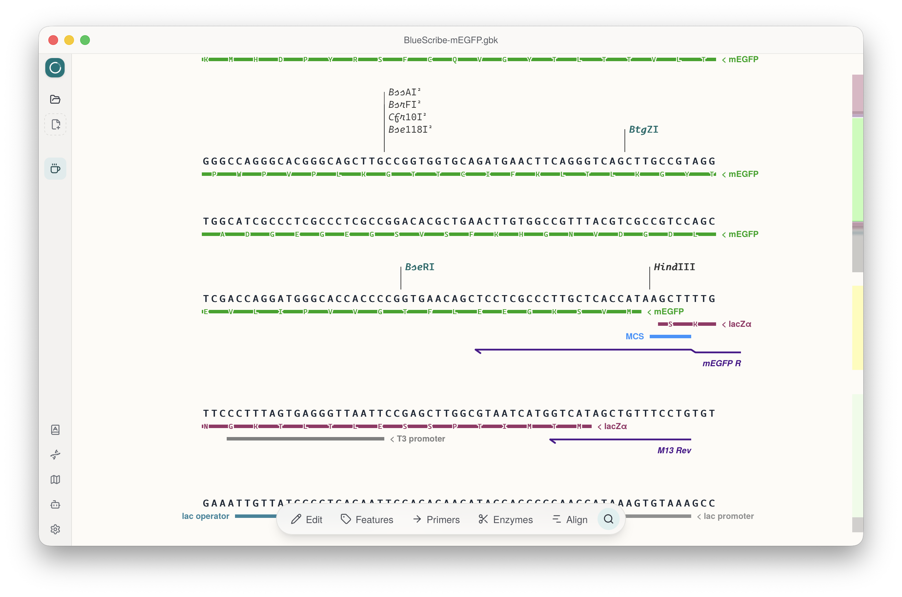
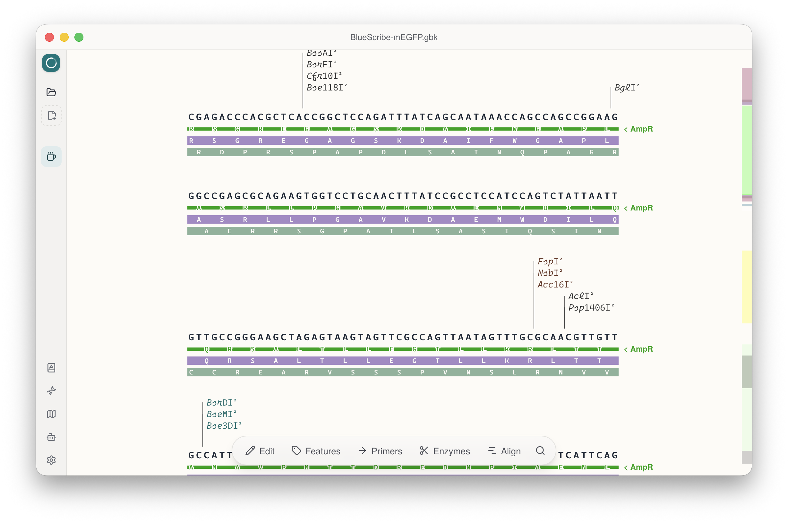
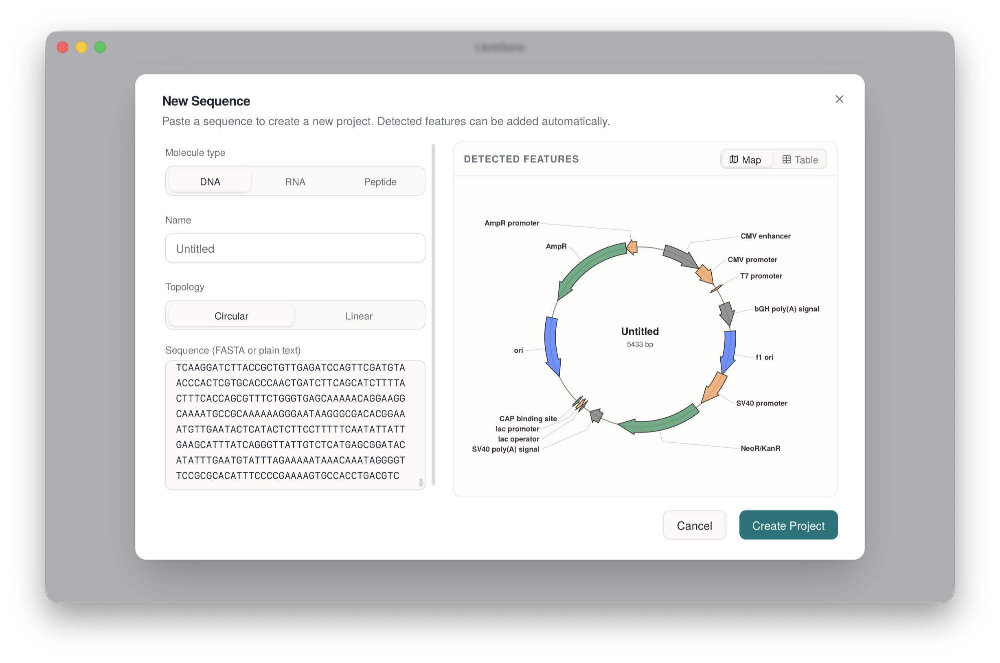
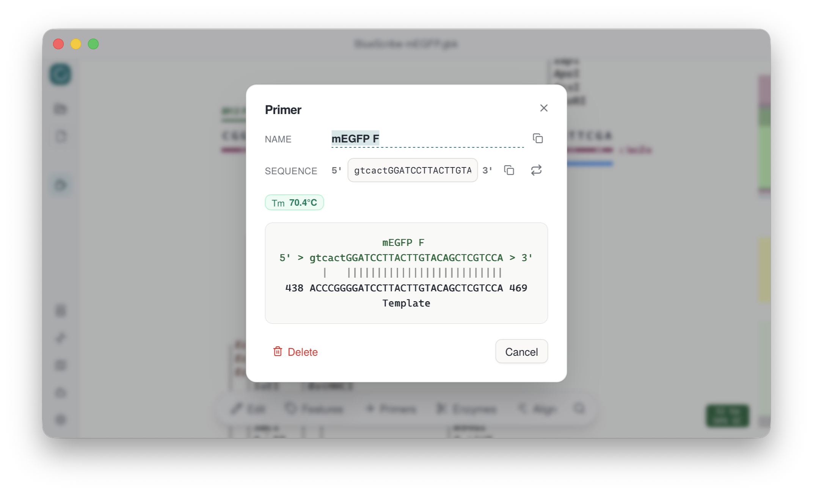
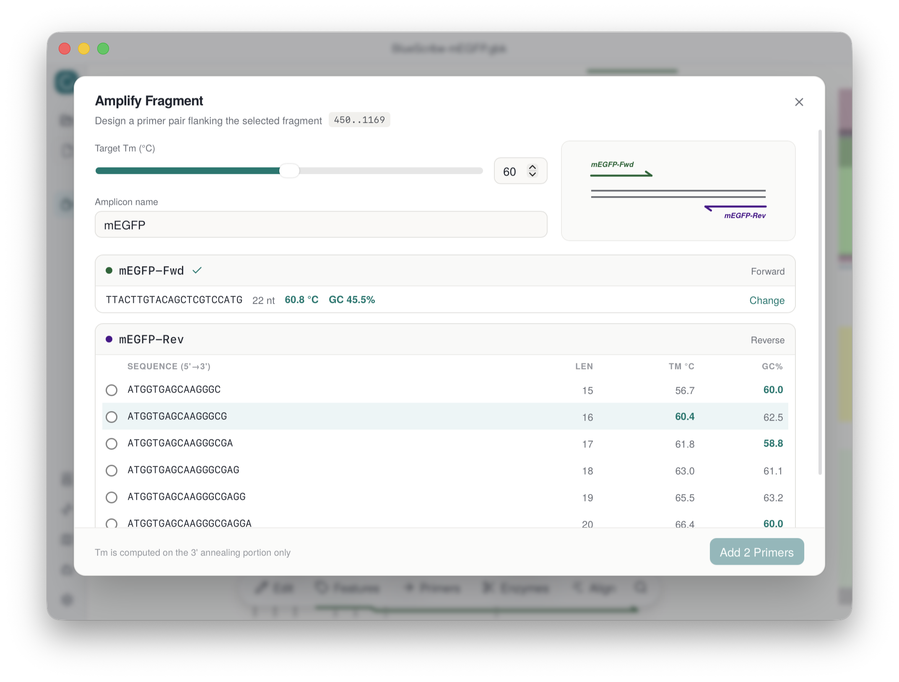
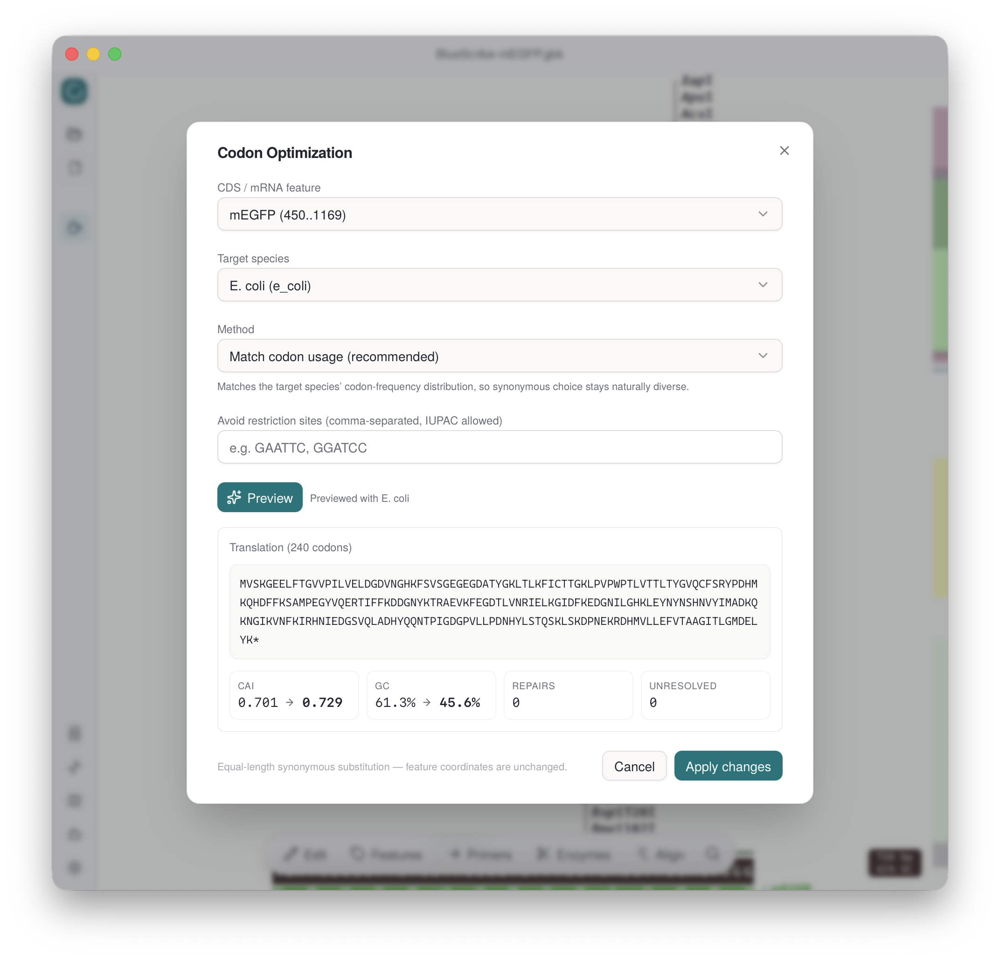
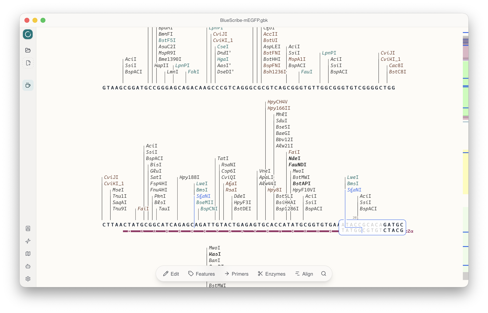
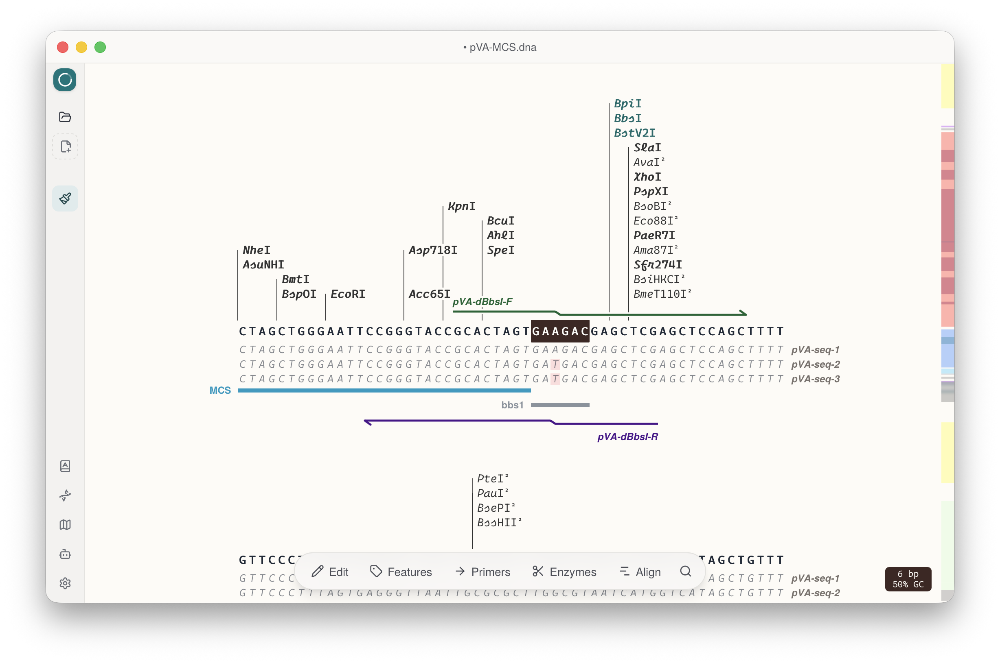
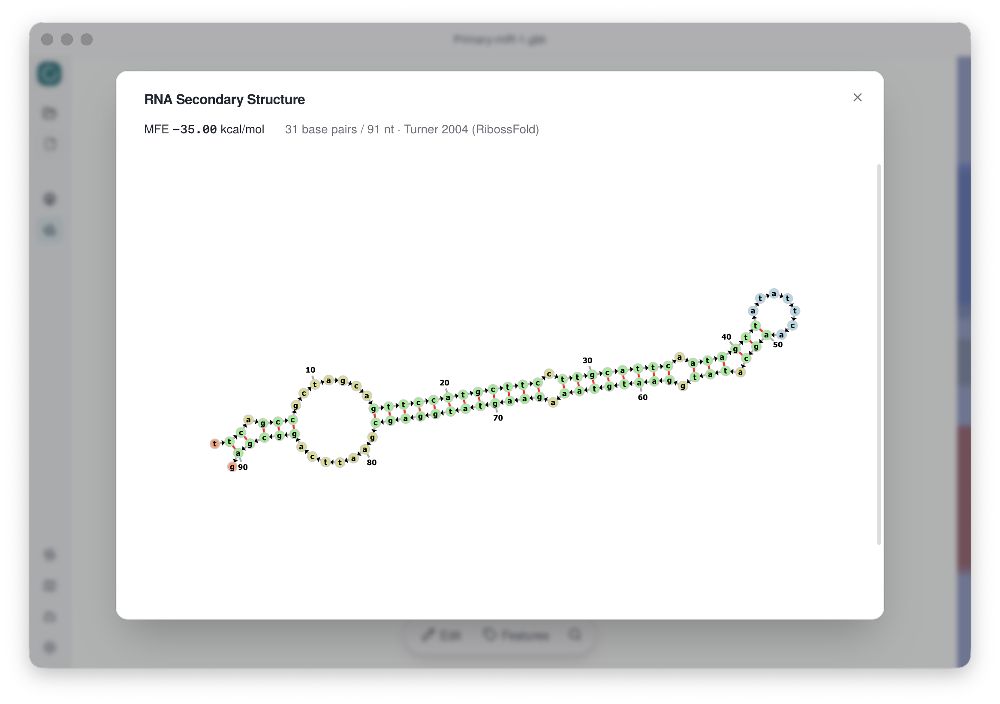

<p align="center">
  
</p>

<h1 align="center">LibreGene — 质粒编辑器</h1>

<p align="center">
  <a href="LICENSE"></a>
</p>

<p align="center"><a href="README.md">English</a></p>

> **⚠️ 早期开发阶段** — 接口和文件格式尚未稳定。
> **已在 macOS 和 Windows 上测试通过** — Linux 版本尚未验证。

轻量级跨平台桌面质粒编辑器。纯 SVG 渲染，支持特征标注、引物设计与可视化、酶切分析——全部免费开源。

<p align="center">
  
</p>

## 功能特性

### 特征标注

- **极简显示** — CDS / mRNA 特征自动翻译，氨基酸直接渲染在序列下方
- **自动检测与标注** — 在「新建序列」对话框粘贴序列，常见特征（启动子、抗性标记、ori、标签等）通过 [pLannotate](https://github.com/mmcguffi/pLannotate) 特征数据库自动检测，一键勾选即可标注
- **ORF 搜索** — 双链六读框扫描开放阅读框，结果内联显示
- 支持复合（多段）特征、自定义颜色、链方向切换，增强型 GenBank 读写可保留颜色和引物注释

<p align="center">
  
  
</p>

### 引物

- **匹配情况可视化** — 每条引物与模板逐碱基比对，错配、退火区和 Tm 值（最近邻法）一目了然；结合位点搜索遵循 [pydna](https://github.com/pydna-group/pydna) 的退火算法
- **辅助设计** — 支持片段扩增、重叠延伸 PCR（OE-PCR）和定点诱变，候选引物按 Tm / GC% 排列，可加酶切位点尾巴

<p align="center">
  
  
</p>

### 密码子优化

- **内置 9 个物种的密码子使用表**（[Kazusa](https://www.kazusa.or.jp/codon/) 数据）— 可将任意 CDS / mRNA 特征优化为目标表达宿主
- **三种策略** — 最优密码子、匹配密码子使用频率（保持天然同义多样性）、或针对源物种做相对密码子适应度协调（harmonize）；算法移植自 [DNA Chisel](https://github.com/Edinburgh-Genome-Foundry/DnaChisel)
- **先预览再应用** — 翻译校验、CAI 与 GC% 前后对比一目了然；等长同义替换不改变特征坐标；可选避免产生指定酶切位点

<p align="center">
  
</p>

### 限制性内切酶

- **内置 900+ 酶数据库**（导出自 [Biopython](https://biopython.org) 的 `Bio.Restriction`），支持甲基化感知过滤
- **分类清晰** — 唯一切点（unique）、双切点（twice）、平末端（blunt）和 IIS 型酶区分显示，切割位点同步标注在侧边滚动条上，方便快速定位
- **自定义酶组** — 可定义自己的酶集合并随时切换

<p align="center">
  
</p>

### 序列比对

- **多种格式** — 支持导入 Sanger 测序结果（.ab1）、FASTA 和 GenBank 序列，与参考序列比对显示
- 错配、插入和缺失原位高亮，自动计算每条读段的一致性（identity）

<p align="center">
  
</p>

### RNA 二级结构

- **MFE 折叠** — 基于 Turner 2004 最近邻模型的最小自由能预测，由 [RibossFold](https://github.com/mirditalab/RibossFold) 以 WebAssembly 在本地运行
- **交互式布局** — 采用 [forna](https://github.com/ViennaRNA/forna)（ViennaRNA）经典力导向结构视图，支持平移缩放和拖拽核苷酸

<p align="center">
  
</p>

### 更多

- **SVG 质粒图谱**，多行自适应换行显示
- **插件系统** — 可扩展架构，方便添加自定义工具
- **多项目标签页** — 侧边栏快速切换
- **完整的撤销/重做** — 序列编辑和特征修改均可回退
- **GenBank / SnapGene** — 读写 .gb/.gbk，读取 .dna（[SnapGene](https://www.snapgene.com)）

## 快速开始

```bash
npm install
npx tauri dev
```

需要 Node.js ≥ 20、Rust ≥ 1.75 以及 [Tauri v2 系统依赖](https://v2.tauri.app/start/prerequisites/)。

## MCP / LLM Agent 集成

LibreGene 内置了 [MCP](https://modelcontextprotocol.io) 服务器（仅监听本机回环 `127.0.0.1:8766`，Bearer token 鉴权），让终端里的 LLM Agent 像真实用户一样操作已打开的质粒——UI 实时同步更新。先启动 LibreGene；连接方式与访问令牌见 app 侧边栏的 *MCP Server* 对话框（或空项目界面的 "Connect an LLM agent via MCP" 链接）。

共暴露 21 个工具，覆盖完整编辑流程：

- **项目与文件** — `open_file`、`save_file`、`close_project`、`activate_project`、`list_projects`、`export_subsequence`
- **读取** — `read_sequence`、`get_project_overview`、`get_region_view`、`search_sequence`（IUPAC 模糊搜索，肽段查询自动展开为简并密码子）
- **编辑** — `edit_sequence`（插入/删除/替换）、`add_feature`、`update_feature`
- **引物** — `add_primer`、`list_primers`、`check_primer_binding`（结合位点 + Tm）、`design_primers`（扩增 / OE-PCR / 诱变）
- **分析** — `find_restriction_sites`、`find_orfs`、`add_alignment`、`optimize_cds`（9 个物种的密码子优化）

### 示例任务

[`examples/tasks`](examples/tasks) 目录收录了可直接运行的 Agent 任务，每个都附带 `Prompt.txt`（可直接发给 Agent 的自然语言指令）和参考结果：

- **[Primer Design](examples/tasks/Primer%20Design)** — 将 mEGFP 克隆进 BamHI/HindIII 消化过的 BlueScribe 载体：设计带酶切尾巴的克隆引物、挑选菌落 PCR 鉴定引物，再设计 A206K 定点诱变引物
- **[Alignment](examples/tasks/Alignment)** — 给定 pVA-MCS 和三份 Sanger `.ab1` 测序结果，判断哪个样本成功突变掉了 BbsI 酶切位点
- **[Drosophila RNAi](examples/tasks/Drosophila%20RNAi)** — 根据载体序列和实验 Protocol，设计靶向目标基因（GOI）的 RNAi 质粒

## 许可证

GNU General Public License v3.0 — 参见 [LICENSE](LICENSE)。

Copyright (C) 2025 dl-li
