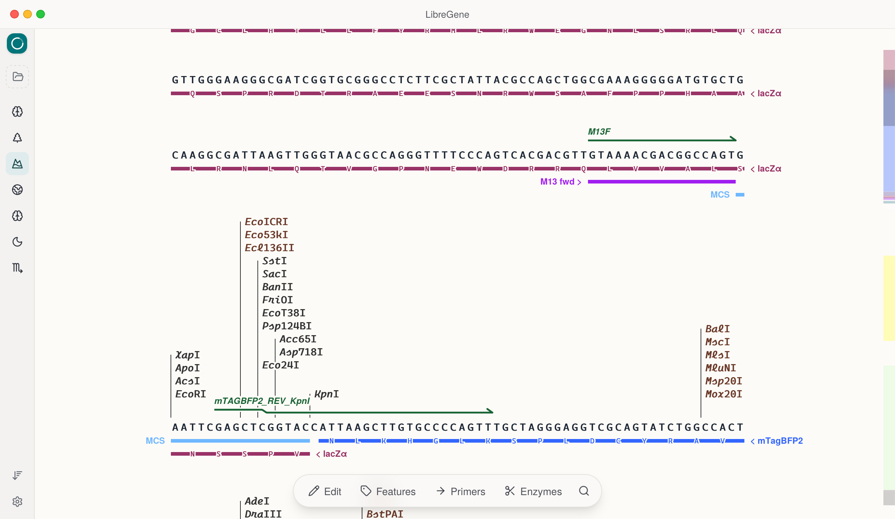

<p align="center">
  
</p>

<h1 align="center">LibreGene — 质粒编辑器</h1>

<p align="center">
  <a href="LICENSE"></a>
</p>

<p align="center"><a href="README.md">English</a></p>

> **⚠️ 早期开发阶段** — 接口和文件格式尚未稳定。
> **已在 macOS 和 Windows 上测试通过** — Linux 版本尚未验证。

轻量级跨平台桌面质粒编辑器。纯 SVG 渲染，支持特征标注、引物设计与可视化、酶切分析——全部免费开源。

<p align="center">
  
</p>

## 功能特性

- **SVG 质粒图谱**，多行自适应换行显示
- **特征标注** — CDS、启动子、终止子、复合特征、自定义颜色、链方向切换
- **引物可视化** — 添加、比对、Tm 值计算（最近邻法）、结合位点显示
- **限制性内切酶** — 内置 900+ 酶数据库，甲基化感知过滤，单/唯一切割位点视图，甲基化敏感/依赖型模式检测
- **序列比对** — 导入多读序比对数据（.ab1、FASTA），与参考序列并行可视化
- **ORF 搜索** — 搜索并显示双链上的开放阅读框
- **插件系统** — 可扩展架构，内置序列比对和 ORF 搜索插件
- **多项目标签页** — 侧边栏快速切换
- **完整的撤销/重做** — 序列编辑和特征修改均可回退
- **GenBank / SnapGene** — 读写 .gb/.gbk，读取 .dna（SnapGene），支持颜色和引物注释增强格式


## 快速开始

```bash
npm install
npx tauri dev
```

需要 Node.js ≥ 20、Rust ≥ 1.75 以及 [Tauri v2 系统依赖](https://v2.tauri.app/start/prerequisites/)。

## 许可证

GNU General Public License v3.0 — 参见 [LICENSE](LICENSE)。

Copyright (C) 2025 dl-li
